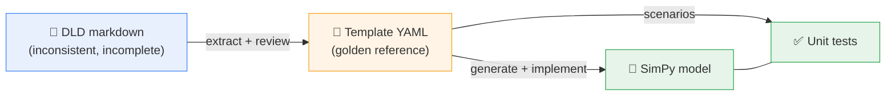
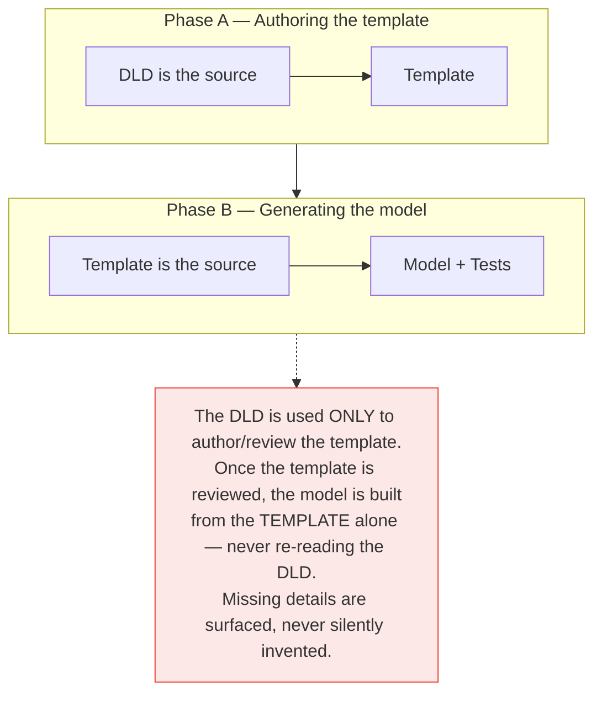
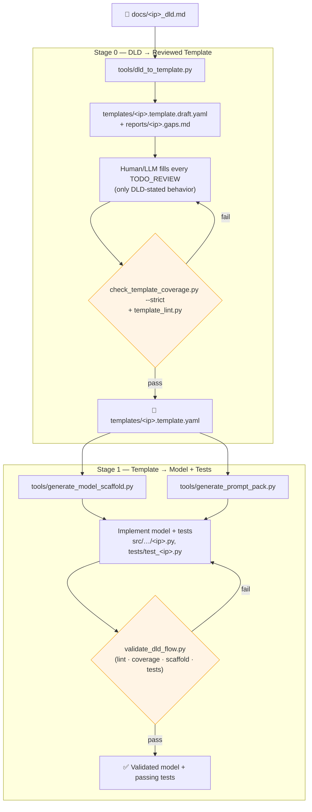
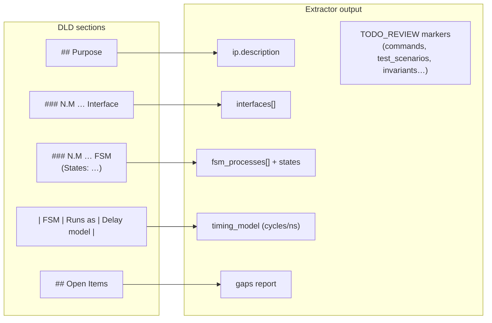
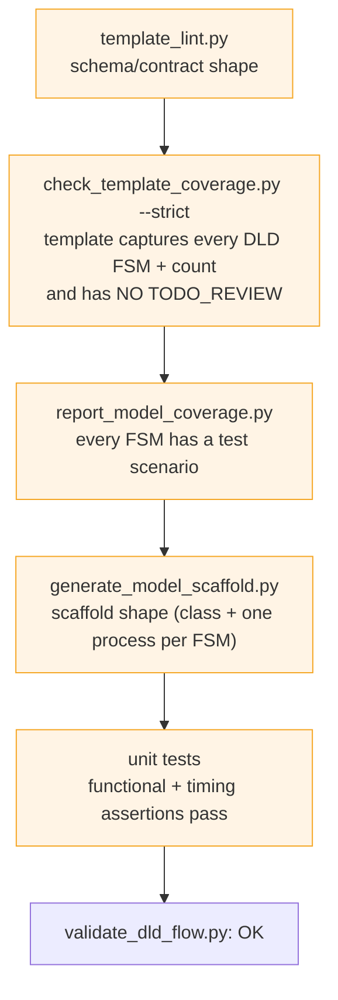
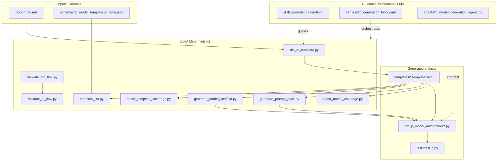
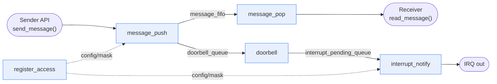
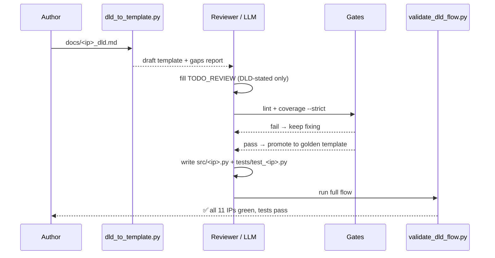

# IP Model Automation — Pipeline Overview

This document explains **what this project does** and **how the flow works**, end
to end, from a hardware IP design document to a validated SimPy performance model
with unit tests.

---

## 1. What we are doing

Hardware teams hand us **DLDs** (Design-Level Documents): human-written markdown
that describes an IP block — its interfaces, internal state machines (FSMs),
timing, and behavior. We need a **SimPy transaction-level delay model** and
**unit tests** for each IP.

Two problems make this hard:

1. **DLDs are inconsistent.** Every author formats things differently.
2. **DLDs omit details.** Command encodings, test scenarios, and exact invariants
   are often missing.

So we do **not** generate models directly from the DLD. Instead we introduce a
**template** as a normalized, machine-checkable *golden reference* in the middle:



### The key rule: two sources of truth, one at a time



This separation is what keeps generated models trustworthy: a reviewer signs off
the template once, and everything downstream is a faithful function of it.

---

## 2. The end-to-end flow



### ASCII version (same flow)

```text
docs/<ip>_dld.md
      │
      ▼   Stage 0: DLD → Reviewed Template
 dld_to_template.py ── draft template + gaps report
      │
      ▼
 fill TODO_REVIEW  ◄──── (loop until gates pass)
      │
      ▼
 [gate] template_lint.py + check_template_coverage.py --strict
      │  pass
      ▼
 templates/<ip>.template.yaml   (golden reference)
      │
      ▼   Stage 1: Template → Model + Tests
 generate_model_scaffold.py + generate_prompt_pack.py
      │
      ▼
 implement src/<ip>.py + tests/test_<ip>.py  ◄──── (loop)
      │
      ▼
 [gate] validate_dld_flow.py  →  ✅ done
```

---

## 3. Stage 0 in detail — turning a messy DLD into a clean template

`tools/dld_to_template.py` is a **best-effort extractor**. It parses the DLD's
markdown conventions and fills what it can; anything it cannot derive is marked
`TODO_REVIEW` and listed in a **gaps report**.



**What the extractor reliably gets:** FSM names + states, interface sections,
per-FSM timing operations, clock rate, and the FSM count.
**What it leaves for review:** commands, test scenarios, invariants, transition
detail, and any IP-specific contract fields.

### Why a gaps report instead of guessing

The gaps report (`reports/<ip>.gaps.md`) lists the DLD's own **Open Items** plus
every `TODO_REVIEW` field. This makes missing information *visible and tracked*
rather than silently filled with a plausible-but-wrong assumption.

---

## 4. The gates (what "validated" means)

Every stage is guarded by an automated gate. Nothing advances until its gate is
green.



`tools/validate_dld_flow.py` runs the front-end gate for **every** DLD (template
exists, lints, covers the DLD) and then delegates to `validate_ip_flow.py` for the
model/test flow — a single command that proves the whole repo is consistent.

### Calibration — how we trust the extractor

The extractor was tuned against the existing golden IPs: **re-parsing each DLD
reproduces its template's FSM name set exactly**, and the DLD's stated
"Total FSM/processes: N" matches the template's `fsm_count`. That equality is the
regression gate — if a future change breaks extraction, calibration fails loudly.

> Interface sections are **report-only**, because templates legitimately
> consolidate them (e.g. a "Watchdog Heartbeat" DLD section folded into another
> template interface). FSM coverage is the hard gate; interfaces are informational.

---

## 5. Repository components



| Area | Role |
| --- | --- |
| `docs/*_dld.md` | Human design intent (authoring source only). |
| `templates/*.template.yaml` | **Golden reference** — source of truth for generation. |
| `schemas/…schema.json` | Machine-checkable template contract. |
| `tools/*.py` | Deterministic extraction, linting, coverage, generation, validation. |
| `skills/…`, `harness/…`, `agents/…` | Instructions/contract for the human or LLM that fills templates, models, and tests. |
| `src/ip_model_automation/*.py` | Flat, one-file-per-IP SimPy delay models. |
| `tests/test_*.py` | Per-IP unit tests derived from `test_scenarios`. |

---

## 6. What a generated model looks like

Each template FSM becomes one SimPy process; queues/stores connect them. Example —
the **Mailbox IP** (one of the two IPs added through this pipeline):



- **Concurrency:** all five FSMs run as parallel `env.process(...)` loops.
- **Sequencing:** a message must be *enqueued* → *doorbell raised* → *interrupt
  asserted*; FIFO-full applies backpressure; masked channels suppress interrupts.
- **Timing:** every delay comes from the template's `timing_model`.
- **Observability:** IP-tagged logs (`[mailbox_ip] …`) and a `metrics` dict the
  unit tests assert on.

---

## 7. How to add a new IP (worked recipe)



Concretely:

1. Write `docs/<ip>_dld.md` (Purpose, Interfaces, FSMs+States, timing table, Open Items).
2. `python tools\dld_to_template.py docs\<ip>_dld.md` → draft + gaps.
3. Fill every `TODO_REVIEW`; resolve gaps using only DLD-stated behavior.
4. `python tools\check_template_coverage.py templates\<ip>.template.draft.yaml docs\<ip>_dld.md --strict`
   then promote to `templates\<ip>.template.yaml`.
5. Implement `src/ip_model_automation/<ip>.py` and `tests/test_<ip>.py`
   (register the model in `common.py` + `ip.py`).
6. `python tools\validate_dld_flow.py` → green.

This is exactly the path used to add `mailbox_ip`, `spi_master_ip`, and
`i3c_ip`: brand-new DLDs went through extraction, review, modeling, and
testing, and the whole 11-IP suite validated with 58 passing tests. The same
path also carries subsystems (`dma_subsystem`, `mailbox_irq_subsystem`):
connected clusters of member IPs whose glue processes are their FSMs and whose
member models are their resources, so every existing gate applies unchanged.

---

## 8. Summary

- We convert **inconsistent, incomplete DLDs** into **validated SimPy models**.
- A **normalized template** sits in the middle as the golden reference.
- **Deterministic tools** handle extraction, linting, coverage, and validation;
  a **human/LLM** fills the judgment gaps under a strict contract.
- **Missing details are surfaced** in a gaps report, never invented.
- **Every stage has an automated gate**, and one command
  (`validate_dld_flow.py`) proves the whole repo is consistent.
