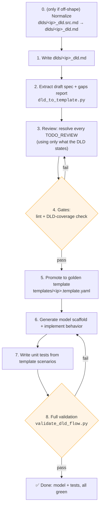
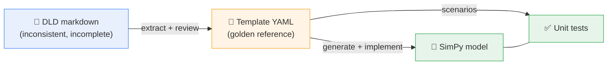
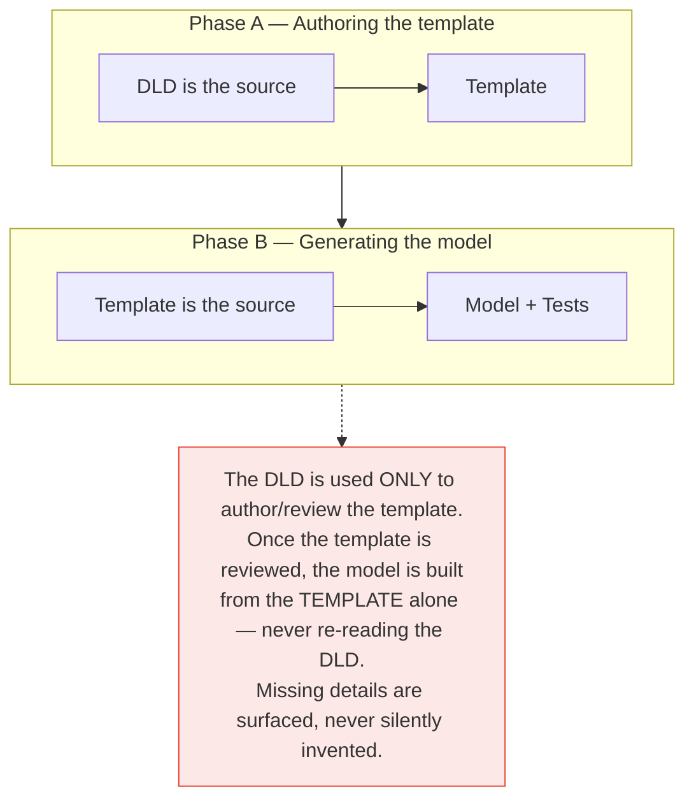
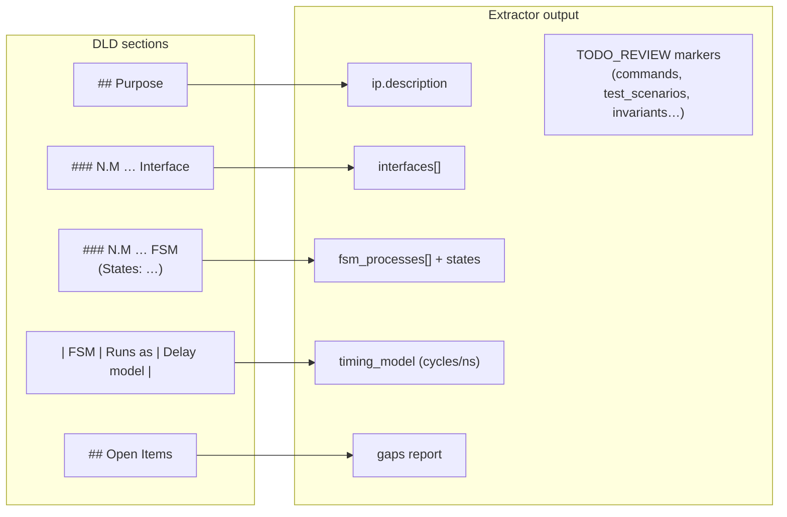
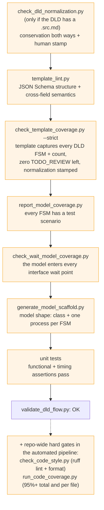
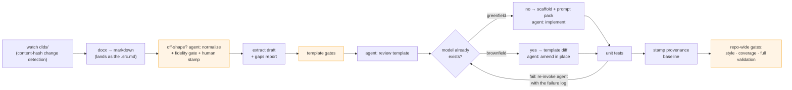
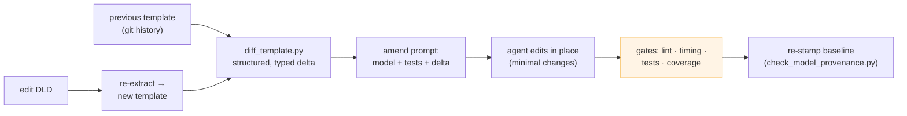
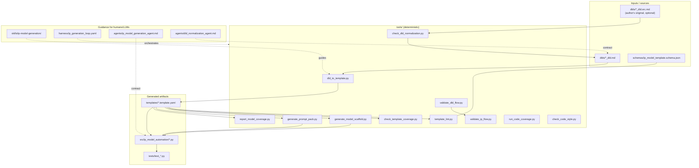

# IP Model Automation — Project Overview

**Reading this for the first time?** This document answers three questions, in
order:

1. [What does this system do for me?](#part-1--what-this-system-does-for-you)
2. [How do I generate a model and unit tests from my DLD?](#part-2--how-to-go-from-a-dld-to-a-model--tests)
3. [What actually happens in the background?](#part-3--how-it-works-behind-the-scenes)
4. [Show me one real IP, end to end.](#part-4--worked-example-completion_ip-end-to-end)

The exact CLI command reference lives in the [README](../README.md). Current
project status is at the [end of this document](#part-5--current-status).

> **Prefer Word?** This document also exists as
> [project_overview.docx](project_overview.docx) with all diagrams embedded —
> same content, shareable outside the repo. This Markdown file is the canonical
> source; the docx is **generated** from it by
> `python tools/render_overview_docx.py`, kept honest by a
> provenance check (`python tools/check_overview_sync.py`) that fails if the
> docx drifts from this file.
>
> **Standalone diagrams:** every flow diagram in this document also exists as
> a plain SVG image in [docs/diagrams/](diagrams/) — open
> [diagrams/index.html](diagrams/index.html) in a browser to view them all, or
> drop the individual `.svg` files straight into slides and documents. No
> markdown/mermaid viewer needed.

---

# Part 1 — What this system does for you

## The one-sentence version

> You write a design document for your hardware IP block; this system turns it
> into a **runnable performance model** (Python/SimPy) and a **unit test
> suite** — with automated checks at every step so nothing is invented or
> lost along the way.

## What goes in, what comes out

**You provide:** a DLD (Design-Level Document) — an ordinary markdown (or
Word) file describing your IP block: what it does, its interfaces, its
internal state machines (FSMs), and how many cycles each operation takes.
Examples live in `dlds/` — e.g. [completion_ip_dld.md](../dlds/completion_ip_dld.md).

**You get back:**

| Output | What it is | Where it lands |
| --- | --- | --- |
| **SimPy model** | A Python simulation of your IP: every FSM runs as a concurrent process, every delay comes from your DLD's timing table. You can run traffic through it and measure latency, throughput, backpressure. | `src/ip_model_automation/<ip>.py` |
| **Unit tests** | Tests that check the model's functional behavior *and* its timing against what the DLD stated. | `tests/test_<ip>.py` |
| **Gaps report** | A checklist of everything your DLD *didn't* say (missing timing, unclear behavior, open items) — so you know exactly what to clarify instead of discovering it later. | `reports/<ip>.gaps.md` |
| **Readable spec** | A clean, browsable HTML/Markdown rendering of the normalized spec extracted from your DLD — handy for reviews. | `reports/template_docs/` |

## Why would I want a SimPy model?

Long before RTL exists, a transaction-level delay model lets you answer
questions like:

- *What's the end-to-end latency of a DMA descriptor under load?*
- *Where does backpressure build up when the completion queue is slow?*
- *Is the arbitration policy fair across tenants at high occupancy?*

The repo includes a ready-made experiments layer (`tools/run_experiments.py`)
that sweeps a model parameter against a fixed workload and produces CSV +
markdown result tables.

## The core promise: nothing is invented

DLDs are written by humans, so they vary in format and always omit *something*.
This system **never guesses**. Anything the DLD doesn't state is flagged in
the gaps report and marked `TODO_REVIEW` for a human (or an LLM under a strict
contract) to resolve — using only what the DLD actually says. Automated gates
block progress until every marker is resolved. That's what makes the generated
model trustworthy.

---

# Part 2 — How to go from a DLD to a model + tests

## The short version (fully automated)

Drop your DLD into `dlds/` and run the pipeline:

```powershell
# 1. Add your document (markdown or .docx both work)
copy my_ip_dld.md dlds\

# 2. Run the automated pipeline
python tools\auto_ip_pipeline.py
```

The pipeline detects the new document and drives everything: normalization (if
your DLD is not already in the shape the extractor reads), extraction, review
prompts, gate checks, model scaffolding, implementation prompts, unit tests,
and a final repo-wide validation. Three steps in the middle need judgment
(reshaping an off-shape document, reviewing the extracted spec, and
implementing model behavior) — for those the pipeline either:

- **writes a ready-to-send prompt** to `reports/agent_requests/` and pauses,
  telling you which IP is *awaiting* which step (you or an LLM complete it,
  then re-run), **or**
- **runs unattended** if you give it a coding agent — any vendor's agent
  works (Claude, Codex, Gemini, in-house) as long as it runs headless, reads
  the prompt from stdin, and can edit files. The runner pipes the prompt in,
  validates the result, and retries with the failure log if validation fails:

  ```powershell
  python tools\auto_ip_pipeline.py --agent codex        # named profile from the harness YAML
  python tools\auto_ip_pipeline.py --agent-cmd "my-agent --auto"   # any raw command
  ```

When the pipeline reports green, you have a validated model in
`src/ip_model_automation/` and passing tests in `tests/`.

One of those pauses is a person, not an agent: a normalized DLD needs a human
to confirm that its meaning survived the reshaping (see
[Normalizing a DLD](#normalizing-a-dld-written-in-another-shape) below). It is
one command per IP, and it is the only judgment in the system that is
deliberately not automatable.

## The step-by-step version (manual, so you see each stage)



1. **Write the DLD** — `dlds/<ip>_dld.md`, with the usual sections: Purpose,
   Interfaces, FSMs (with their states), a timing table, and Open Items.
   Any existing DLD in `dlds/` is a good example to copy the shape of.

2. **Extract** a draft spec and a gaps report:

   ```powershell
   python tools\dld_to_template.py dlds\<ip>_dld.md
   ```

3. **Review** the draft (`templates/<ip>.template.draft.yaml`): replace every
   `TODO_REVIEW` marker. The rule: fill in only what the DLD states — if the
   DLD is silent, fix the DLD (or record the decision there), don't invent.

4. **Pass the gates**, then **promote** the draft:

   ```powershell
   python tools\check_template_coverage.py templates\<ip>.template.draft.yaml dlds\<ip>_dld.md --strict
   python tools\template_lint.py templates\<ip>.template.yaml
   ```

5. **Generate the model scaffold** and fill in behavior *from the template
   only*:

   ```powershell
   python tools\generate_model_scaffold.py templates\<ip>.template.yaml --output-dir src\ip_model_automation
   ```

6. **Write unit tests** from the template's `test_scenarios` (and register
   the model in `common.py` + `ip.py`).

7. **Validate everything**:

   ```powershell
   python tools\validate_dld_flow.py
   ```

This exact path added `mailbox_ip`, `spi_master_ip`, and `i3c_ip`: brand-new
DLDs in, validated models and tests out. (All three have since been retired —
see Part 5. The path is what this section is about, not the passengers.)

## What makes a DLD "extract well"

The extractor understands common DLD conventions. It reliably picks up:

- FSM names, their states, and the total FSM count
- Interface sections
- Per-interface wait models (the `Wait model:` block each interface states)
- Per-FSM timing operations and the clock rate

It deliberately leaves for human review: command encodings, test scenarios,
invariants, and transition details — these are where DLDs are most often
ambiguous, so they get flagged instead of guessed.

## Normalizing a DLD written in another shape

The extractor is deterministic: it reads the conventions above and degrades to
`TODO_REVIEW` when they are absent. That is what makes it trustworthy — and it
also means a DLD written in some other shape extracts badly, and somebody has to
reshape it by hand before the pipeline is useful.

The `normalize_dld` stage does that reshaping. It rewrites the author's document
into the shape the extractor reads, **changing structure only** — never adding,
removing, altering, or even rewording an engineering claim. Two files per IP, so
your original is never edited in place:

| File | Role |
| --- | --- |
| `dlds/<ip>_dld.src.md` | Your original, in whatever shape you wrote it. A `.docx` DLD's conversion output lands here. |
| `dlds/<ip>_dld.md` | The normalized, extractor-shaped document — still the pipeline's input, so nothing downstream changes. |

**A DLD already in shape has no `.src.md` and skips the stage entirely.**

Three properties make this safe to put in front of everything else:

1. **It replaces no existing gate.** If a normalization is bad, extraction
   degrades to `TODO_REVIEW` and the strict coverage gate refuses promotion —
   the same failure path a badly-written DLD takes today.
2. **Nothing is lost silently.** Content that maps to no convention is copied
   verbatim into an `## Unplaced Source Content` section the extractor ignores.
   The gate counts it, so "I could not place this" is always visible.
3. **A deterministic gate judges it.** `check_dld_normalization.py` checks
   measurement and identifier conservation *in both directions* (a value that
   appears from nowhere is as suspect as one that vanishes), FSM name, count and
   per-FSM state parity, wait-model provenance, and unplaced accounting.

What that gate cannot prove is that the **meaning** survived — a rewrite could
preserve every number while attaching it to the wrong FSM. So that one claim is
signed by a person, per IP, exactly the way the model provenance baseline is:

```powershell
python tools\check_dld_normalization.py <ip>            # the mechanical half
python tools\check_dld_normalization.py --stamp <ip>    # "I read the diff; the meaning survived"
```

The stamp records a `(source, normalized)` hash pair; editing either file breaks
it and re-requires review. Until it is current, the pipeline reports the IP as
*awaiting review* and `check_template_coverage.py --strict` refuses to promote
its template — so an unreviewed normalization cannot reach a model.

---

# Part 3 — How it works behind the scenes

## The central idea: a template in the middle

The system never generates a model directly from the DLD. The DLD is
human-written prose — inconsistent and incomplete by nature. Instead, a
normalized, machine-checkable **template** (a YAML file with a fixed schema)
sits in the middle as the *golden reference*:



The template captures, in one fixed shape regardless of how the DLD was
written: the IP's FSM processes and states, how they relate (parallel groups,
sequential paths, gating), interfaces, commands, queues (every FIFO with a
declared capacity — bounded depth, or an explicit `unbounded` with the reason),
resources, timing model, invariants, and test scenarios. Each interface also
carries its wait model — whether the requester blocks until the response comes
back, blocks in place for an ack, or collects the ack before starting its next
request. The annotated `templates/reference_template.yaml` documents every
section.

The contract for that fixed shape is enforced in **two non-overlapping layers**,
both run by `tools/template_lint.py`:

- **Structure** — `schemas/ip_model_template.schema.json` is a JSON Schema
  (validated with `jsonschema`) that owns the *shape*: which sections and
  fields exist, their types, and value constraints (e.g. a queue `depth` is a
  positive integer or the literal `unbounded`, and an unbounded queue must
  carry a `depth_note`). It is enforced, not decorative documentation.
- **Cross-field semantics** — the rules JSON Schema cannot express: the declared
  `fsm_count` matching the actual FSM list, every FSM having a timing entry and
  appearing in a test scenario, and the arbitration-IP sub-contract.

Each rule lives in exactly one layer, so the schema and the linter cannot drift
apart — and a template must satisfy both before it can generate a model.

### Two sources of truth — but only one at a time

This is the rule the whole system is built around:



Why this matters: a reviewer signs off the template **once**, and everything
downstream (model, tests, docs, experiments) derives from that reviewed
artifact. The **structure** is machine-enforced end to end — an FSM, queue,
resource, or scenario the model has but the template doesn't (or vice versa) is
a gate failure, not a judgment call (see the gate chain below). The template's
**numeric** timing and queue depths are the declared reference the implementer
carries into the model; the linter checks they are internally coherent (a
queue's declared capacity is real; an operation's `ns` equals `cycles ×
cycle_time_ns`), but note that the numbers are not asserted equal to the model's
constructor defaults — models routinely default latencies low so unit tests run
in a few simulated ticks and take the template's values as overrides. So:
structure is provably faithful; timing is a coherent, reviewed reference rather
than a machine-verified equality.

## Stage 0: DLD → reviewed template

`tools/dld_to_template.py` is a best-effort parser, not an oracle. It maps
DLD sections onto template fields and marks everything else:



The **gaps report** (`reports/<ip>.gaps.md`) combines the DLD's own "Open
Items" section with every field the extractor couldn't derive. The point:
missing information becomes *visible and tracked* instead of silently filled
with a plausible-but-wrong assumption.

**How we know the extractor can be trusted:** it's calibrated against every
existing golden IP — re-parsing each DLD must reproduce its template's FSM
name set exactly, and the DLD's stated FSM count must match the template's
`fsm_count`. That equality runs as a regression gate; if a change breaks
extraction, calibration fails loudly. (Interface matching is report-only,
because templates legitimately consolidate DLD interface sections; FSM
coverage is the hard gate.)

## Stage 1: template → model + tests

From the reviewed template:

- `tools/generate_model_scaffold.py` emits a SimPy skeleton — one model
  class, one process method per template FSM.
- `tools/generate_prompt_pack.py` bundles the template + contract + skill
  instructions into a self-contained prompt, so an LLM can fill in behavior
  without seeing (or needing) anything else.
- The implementer — human or LLM — fills in model behavior and unit tests
  **from the template only**.

### What a generated model looks like

Each template FSM becomes one concurrent SimPy process; queues and stores
connect them. Here is the real **Mailbox IP** model (added through this
pipeline):


Reading this diagram: when software calls `send_message()`, the
`message_push` process enqueues the message (blocking if the FIFO is full —
that's backpressure), raises a doorbell, and the doorbell flows through
`interrupt_notify` to become an IRQ — unless the channel is masked via the
`register_access` process. Every arrow hop costs the number of cycles the
DLD's timing table specified.

Every model also ships with:

- **IP-tagged logging** (`[completion_ip] …`) with `log_level` / `log_file`
  constructor arguments (default `WARNING`; also appends to `run.log`), and
- a **`metrics` dict** the unit tests assert on (counts, latencies,
  occupancies).

### Code conventions

- One **flat** file per IP: `src/ip_model_automation/<ip>.py` — no per-IP
  folders, and no files named `perf_model.py` / `functional_model.py` /
  `soc_models.py` (deliberate repo rule).
- Shared dataclasses, registry metadata, and helpers: `common.py`;
  public export surface: `ip.py`.
- Per-IP tests in `tests/test_<ip>.py`, derived from the template's
  `test_scenarios`.
- Every Python file follows the written coding style guide (next section).
- These paths and the `<CamelIp>Model` naming are **not hardcoded** — they come
  from `target_profile.yaml` (defaults describe this repo). Repointing that
  profile lets the same tooling operate on another SimPy codebase without
  editing tool code; see "Reusing the tooling elsewhere" below.

Run the whole test suite from the repo root:

```powershell
$env:PYTHONPATH="$PWD\src"
python -m unittest discover -s tests
```

### Coding style

All Python code in `src/`, `tools/`, and `tests/` follows one written style
guide:
[skills/ip-model-generation/references/coding_style.md](../skills/ip-model-generation/references/coding_style.md).
It has two halves:

**Machine-enforced rules** — configured in `ruff.toml` at the repo root and
checked by [ruff](https://docs.astral.sh/ruff/) (linter + formatter in one
tool, installed via `requirements.txt`):

- 120-column lines, double quotes, four-space indentation, trailing commas in
  multi-line literals (applied by `ruff format` — never hand-format against it).
- No unused imports or variables, no ambiguous single-letter names
  (pycodestyle + pyflakes rules `E`, `W`, `F`).
- Imports sorted in three groups — stdlib, third-party (`simpy`, `yaml`),
  first-party (`ip_model_automation`) — each alphabetized (rule `I`); models
  inside the package use relative imports (`from .common import ...`).

**Structure conventions** — the shape every model and test file shares,
checked by the scaffold/validation gates and review:

- Model class `<Ip>Model` with a short docstring; constructor order is `env`
  first, then `<operation>_latency` parameters (defaulted from the template's
  timing model), behavioral knobs, and `log_level`/`log_file` last.
- One SimPy process method per template FSM, named `<fsm>_process`, started in
  the constructor with `env.process(...)`.
- Observable state for tests: a `metrics` counter dict (snake_case keys) and,
  where useful, an `fsm_state` dict keyed by FSM name.
- Logging via `get_ip_logger` with lazy `%s` formatting (never f-strings in
  log calls), at the documented levels (DEBUG transitions, INFO lifecycle,
  WARNING expected stalls, ERROR invalid paths).
- Tests use `unittest`, named after the template's `test_scenarios`, assert on
  metrics/completions/state — not log output — and pass small explicit latency
  overrides so they run in a few simulated ticks.

One command checks all of it, and the automated pipeline runs the same command
as a required repo-wide `code_style` stage (a hard gate, right before the
coverage gate):

```powershell
python tools\check_code_style.py          # check — what the pipeline runs
python tools\check_code_style.py --fix    # apply auto-fixes and reformat
```

New models inherit the style at generation time: every prompt pack carries a
"Coding Style" section pointing the implementing agent (human or LLM) at the
guide, and the generation rules in
`skills/ip-model-generation/references/model_generation_rules.md` include the
style check in their validation commands.

## The gates: what "validated" actually means

Every stage is guarded by an automated check. Nothing advances until its gate
is green — this is what lets a reviewer trust a green result without
re-reading everything:



The wait-model gate is the one that keeps interface semantics honest in both
directions: `template_lint.py` proves each declared wait point names a real FSM
state, and `check_wait_model_coverage.py` proves the model actually enters it —
so a template cannot claim the requester blocks for a software clear while the
model asserts the interrupt and loops on.

One command — `python tools\validate_dld_flow.py` — runs the front-end gate
for **every** DLD in the repo (template exists, lints, covers its DLD), then
the model/test flow, and regenerates the readable template docs. A single
green result proves the whole repo is consistent.

To run *every* repo-wide gate, not just that chain — style, code coverage,
provenance, normalization fidelity, and the Word-overview sync as well:

```powershell
python tools\run_ci.py                 # about a minute
python tools\run_ci.py --install-hook  # once per clone: run it before every push
```

This is the repo's CI, and it is **local by choice** — there is no hosted
runner. The gate list is read from the harness, so adding a `scope: repo` stage
adds it to CI with no code change. Running locally gives up two things a hosted
runner provides, so the tool replaces both: it checks that the declared
dependencies are actually installed (locally a gate can quietly depend on a
package one machine happens to have), and it warns when the working tree is
dirty, because then the files being checked are not the commits being pushed.

Two more repo-wide hard gates run in the automated pipeline alongside the
chain above: `python tools\check_code_style.py` (ruff lint + format — the
coding style guide's mechanical half) and `python tools\run_code_coverage.py
--fail-under 95 --fail-under-file 95` — *code* coverage, which model lines the
unit tests actually execute (coverage.py, table + optional `--html` report in
`reports\code_coverage\`), enforced at 95%+ both in total and per model file.

## The automated pipeline runner

`tools/auto_ip_pipeline.py` is the orchestrator that strings all of the above
together so you don't have to run each tool by hand. It is a generic stage
engine: the stage sequence it executes — commands, agent steps and their
gates, skip conditions, per-IP vs. repo-wide scope — is declared in
`harness/ip_generation_loop.yaml`, which is the single source of truth for
the pipeline. Changing the pipeline is a YAML edit, not a runner change:



`normalize_dld` runs only for an IP that has a `dlds/<ip>_dld.src.md`; an
in-shape DLD skips it and its gate entirely, so today's IPs are unaffected by
it. A `.docx` DLD always has one — Word gives no way to write the extractor's
markdown conventions, so its conversion output *is* the author source.

Details worth knowing:

- **Change detection** hashes DLD content into
  `reports/.dld_pipeline_state.json`. An IP is only marked *processed* after
  its full chain passes — so a half-finished IP is automatically picked up
  again next run.
- **The three agent steps** (DLD normalization, template review, model
  implementation) are where judgment is needed. Each declares `gates:` in the harness YAML
  — tool stages whose pass/fail decides everything: if the gates already
  pass, the agent is skipped entirely. Without an agent, the runner writes
  the prompt to `reports/agent_requests/<ip>.<step>.prompt.md` and reports
  the IP as *awaiting*. With `--agent <profile>` (named commands in the
  harness YAML's `agent_profiles`) or `--agent-cmd "<raw command>"`, it pipes
  the prompt to that command and, while the gates fail, re-invokes it with
  the failure log — up to `max_attempts` per stage (default
  `loop_policy.max_iterations`).
- **The agent is a plug-in point, not a dependency**: the prompt pack plus
  the contract in `agents/ip_model_generation_agent.md` are the complete task
  description, and the same gates (template coverage, lint, unit tests,
  coding style, coverage thresholds) judge the output no matter which vendor's
  agent — or which human — wrote the model and its tests.
- **One pause is a human, by design**: the normalization review stamp is a gate
  no machine can satisfy, so it is deliberately kept out of any agent's retry
  loop — the agent iterates against the mechanical half
  (`--no-stamp-check`), and the stamp is a separate stage that reports the IP as
  *awaiting* rather than failed. A gate a machine cannot satisfy must not sit
  inside a machine's loop.
- **Greenfield vs. brownfield is automatic**: the runner snapshots whether the
  model file already exists before any stage runs. A new IP takes the generate
  path (`scaffold` + `agent_implementation`); an existing IP whose DLD changed
  takes the amend path (`amend_implementation`), described next.

## Editing a DLD without rewriting the model

When a DLD changes, you rarely want to regenerate the whole model and tests
from scratch — you want the **minimal edits** that match what actually changed.
The key insight: don't diff the DLD (prose — noisy, reworded, reordered), diff
the **template**. Because the template is the normalized source of truth, two
revisions of it produce a clean, *typed* change list that maps almost
one-to-one to model and test edit sites.



Three pieces make this work, and they reuse what already exists:

- **`tools/diff_template.py`** computes the structured delta between two
  templates and tags every change with a **blast radius** — `SURGICAL` (a
  localized value or addition: a queue depth, a timing number, a new scenario)
  or `STRUCTURAL` (a topology change: an FSM, state, interface, or command
  added/removed, which may cascade). A single structural change escalates the
  whole delta so the implementer knows to review before editing surgically.
  `--amend-prompt` wraps the delta into a ready-to-send instruction: *"here is
  the current model and tests, here is exactly what changed — make the minimal
  corresponding edits, do not rewrite."*
- **Git is the history store.** The "previous" template is just the last
  committed one — `git show HEAD:templates/<ip>.template.yaml` — so no separate
  DLD/template version store is needed.
- **`tools/check_model_provenance.py`** records, per IP, the hash of the
  template each model was last generated or amended against
  (`templates/model_baselines.json`, committed). Its check fails when a
  template has moved on from its recorded baseline — the signal that an amend
  is due — and `--stamp <ip>` refreshes the baseline once the model is back in
  sync. This is the same provenance discipline the docx guard uses, applied to
  the DLD → template → model chain.

A real delta for `mailbox_ip` (message FIFO deepened, an enqueue op re-timed, a
scenario added, and a state added to the doorbell FSM) prints as:

```text
4 change(s), overall blast radius: STRUCTURAL

  [STRUCTURAL] FSM `doorbell` states: +['COALESCE'] -[]
  [SURGICAL  ] queue `message_fifo`.depth: 8 -> 16
  [SURGICAL  ] timing op `message_push.enqueue`: 1cyc/2ns -> 2cyc/4ns
  [SURGICAL  ] test_scenario `fifo_high_watermark_backpressure` added
```

The agent that applies this is the same agent-agnostic step as first-time
generation — only the prompt differs (amend vs. generate). This is **wired into
the pipeline**: `auto_ip_pipeline.py` decides greenfield vs. brownfield from a
snapshot taken at the start of each run — did the model file already exist? A
new IP runs `generate_scaffold` + `agent_implementation` (`when: model_new`); an
existing IP whose DLD changed runs `amend_implementation` (`when: model_exists`),
which feeds the agent the structured template diff instead of the full prompt
pack. Both paths end at the same `unit_tests` gate, then `stamp_provenance`
records the new baseline. If the template change is trivial enough that the
existing tests still pass, the amend agent is skipped entirely.

## Reusing the tooling elsewhere

Everything above operates on *this* repo, but nothing in the tools is bound to
it. Where models, tests, templates, and DLDs live — and how a model file and
class are named — is declared in one place, `target_profile.yaml`, loaded by
`tools/target_profile.py`. The committed profile describes this repo and matches
the tools' built-in defaults, so it changes nothing here; but repointing it lets
the same extraction, generation, diff/amend, and validation tooling run against
a different SimPy framework:

```yaml
paths: {model_dir: sim/models, tests_dir: sim/tests, templates_dir: specs}
naming: {model_file: "{ip}_model.py", model_class: "Sim{camel}"}
```

With that profile, `profile.model_file("mailbox_ip")` resolves to
`sim/models/mailbox_ip_model.py` and `profile.model_class("mailbox_ip")` to
`SimMailboxIp` — no tool-code change. This is the seam that turns the pipeline
from "builds this repo's models" into "an engine you can point at another
codebase." It is being introduced incrementally: the per-IP artifact paths and
the model-class convention already route through the profile (the previously
duplicated camel-case-plus-`Model` logic now lives only in `target_profile.py`);
the remaining hardcoded paths each still resolve to the same default and are
migrated as the other-framework integration firms up.

## Beyond single IPs: subsystems

A subsystem (several IPs wired together) is modeled as **"just another IP"**:
its FSM processes are the glue between member IP models, and the member
models are its resources. It rides the same DLD → template → model → tests
pipeline, so every gate applies unchanged. One extra check,
`tools/check_subsystem_wiring.py`, verifies the wiring is real: members
exist, the member APIs and glue FSMs referenced by `connections:` exist, and
the model actually instantiates its members. Connections can also declare
**ack semantics** — whether the source waits for the destination's done
signal (`ack: none | completion_event | level_until_serviced`, with `ack_via`
naming the return path): the DMA subsystem's IRQ waits for completion events
from both legs, and the mailbox IRQ subsystem's doorbell is the
level-until-serviced example.

## Map of the repository



| Area | Role |
| --- | --- |
| `dlds/*_dld.md` | Your design intent (authoring source only). |
| `templates/*.template.yaml` | **Golden reference** — source of truth for generation. |
| `templates/*.template.draft.yaml` | Extractor output awaiting review (gitignored). |
| `schemas/…schema.json` | JSON Schema for template structure — enforced by `template_lint.py` (structure), which also checks the cross-field semantics the schema can't express. |
| `tools/*.py` | Deterministic extraction, linting, coverage, generation, validation. |
| `skills/…`, `harness/…`, `agents/…` | Instructions/contract for the human or LLM that fills templates, models, and tests. |
| `src/ip_model_automation/*.py` | Flat, one-file-per-IP SimPy delay models. |
| `tests/test_*.py` | Per-IP unit tests derived from `test_scenarios`. |
| `reports/` | All generated output (gitignored): gaps reports, readable template docs, agent requests, experiment results, pipeline state. |
| `prompt_packs/` | Generated LLM prompt bundles (gitignored). |

---

# Part 4 — Worked example: `completion_ip`, end to end

`completion_ip` went through the exact pipeline described in Parts 2 and 3 — a
DLD in, a validated model and tests out. Every artifact below exists in the
repo, so you can open each file and follow along.

## The input: one markdown DLD

[dlds/completion_ip_dld.md](../dlds/completion_ip_dld.md) describes command
completion scheduling with per-tenant QoS in ordinary prose: purpose and scope,
three interfaces, three FSMs with their states and transitions, QoS rules, a
per-FSM timing table, and an honest **Open Items** list. The parts the extractor
leans on look like this:

```text
### 6.2 Completion Scheduler FSM

States:

- `RESET`: initialize scheduling order.
- `IDLE`: wait for pending completion candidates.
- `SELECT_TENANT`: choose next tenant based on weighted order.
- `CHECK_TOKENS`: verify IOPS/BW tokens.
- `WAIT_TOKENS`: no sufficient tokens for selected command.
- `EMIT`: send completion to output interface.
- `STALL_OUTPUT`: completion output not ready.

| FSM/process              | Runs as                    | Delay model                              |
| ---                      | ---                        | ---                                      |
| Completion Scheduler FSM | Parallel scheduler process | Tenant select: 8 cycles = 16 ns. Token check: 5 cycles = 10 ns. … |
```

And what the author didn't know yet (section 11, Open Items): the exact
completion queue depth, error behavior for inactive tenants, whether service
latency is supplied externally or generated inside the IP, and whether the
scheduler shares arbitration policy code with Arbitration IP. These stay visible
through the whole flow instead of being silently guessed.

## Step 1 — extract a draft spec + gaps report

```powershell
python tools\dld_to_template.py dlds\completion_ip_dld.md
```

```text
wrote draft:  templates\completion_ip.template.draft.yaml
wrote report: reports\completion_ip.gaps.md
wrote doc:    reports\template_docs\completion_ip.template.draft.html
Next: resolve TODO_REVIEW markers, lint, check coverage, then promote.
```

The extractor found the mechanical facts on its own, including each interface's
wait model, and flagged the judgment-needing parts. This is the real report,
abridged only where it repeats itself:

```text
## Extracted

- FSMs (3): accept, completion_scheduler, refill
- Interfaces (3): accepted_command_if, qos_configuration_if, completion_queue_if
- Declared fsm_count: 3

### Interface wait models

- `accepted_command_if`: wait_for_ack_inline (stated in DLD)
- `qos_configuration_if`: wait_for_ack_inline (stated in DLD)
- `completion_queue_if`: wait_for_ack_inline (stated in DLD)

## Missing / To Review

- fsm_processes.accept: no exit stated from `RESET`; TODO_REVIEW transition emitted
  — state how this state is left, or that it is terminal
  … (one such line per state, 15 in total)
- commands: not derivable from DLD; TODO_REVIEW placeholder emitted
- test_scenarios: author from DLD behavior; TODO_REVIEW placeholder emitted
- functionality_model.invariants/apis/state_variables: complete from DLD

## DLD Open Items

- Exact completion queue depth.
- Error behavior for inactive tenants.
- Whether command service latency is supplied externally or generated inside
- Whether completion scheduler shares arbitration policy code with Arbitration
```

Two things in that output are worth reading as the extractor being honest about
its own limits rather than as defects in the DLD. It asks for an exit from all
fifteen states even though §6 does state transitions — it reads them from a
separate `Transitions:` block it does not attach per state. And the last two Open
Items are cut off mid-sentence, because those bullets wrap across lines in the
source. Both are why a reviewer reads the DLD rather than the report alone.

## Step 2 — review: resolve every `TODO_REVIEW`

A reviewer (human or LLM under the contract) replaced each marker using only
DLD-stated behavior. The DLD's QoS rules — a completion needs its tenant alive,
its tokens available, and the output ready — became this reviewed command entry:

```yaml
- name: READ
  description: Read completion candidate.
  fields: [tenant_id, cmd_id, size_kb, status]
  valid_conditions: [service_latency_elapsed, tenant_alive, read_tokens_available, output_ready]
  completion_conditions: [completion_emitted]
  error_conditions: [tenant_inactive, read_token_starvation]
```

The Open Items were handled without inventing numbers. "Exact completion queue
depth" is unanswered by the DLD, so the template does not answer it either — the
queue is declared `depth: unbounded` and carries a note saying why:

```yaml
- name: tenant_pending_queues
  depth: unbounded
  depth_note: DLD leaves completion queue depth open; the model keeps per-tenant
    pending queues unbounded — backpressure comes from QoS token gating and
    output cpl_ready, not queue capacity.
```

That is the first of the three cases in [decisions/README.md](../decisions/README.md):
an unstated value is left unset and the backpressure that does exist is named,
rather than a depth being picked so the field looks filled in.

## Step 3 — pass the gates, promote to golden

```powershell
python tools\check_template_coverage.py templates\completion_ip.template.draft.yaml dlds\completion_ip_dld.md --strict
python tools\template_lint.py templates\completion_ip.template.yaml
```

```text
  DLD-stated wait models: {'accepted_command_if': 'wait_for_ack_inline', …}
    accepted_cmd_if: wait_for_ack_inline (source=dld)
    qos_config_if: wait_for_ack_inline (source=dld)
    completion_queue_if: wait_for_ack_inline (source=dld)
coverage: OK
templates/completion_ip.template.yaml: OK
```

For `completion_ip` these proved: all three DLD FSM names and the declared
`fsm_count: 3` are captured, every state list matches, each interface's wait
model is carried through with its provenance (`source=dld`, not an assumed
default), zero `TODO_REVIEW` markers remain, and the YAML satisfies the
schema/contract. The draft was then renamed to the golden
[templates/completion_ip.template.yaml](../templates/completion_ip.template.yaml)
— from here on, the DLD is never read again.

## Step 4 — scaffold + implement the model

```powershell
python tools\generate_model_scaffold.py templates\completion_ip.template.yaml --output-dir src\ip_model_automation
```

Each of the three template FSMs became one concurrent SimPy process in
[src/ip_model_automation/completion_ip.py](../src/ip_model_automation/completion_ip.py).
Here is the real scheduler loop — every line traces back to the template: the
state names, the per-operation timeouts from `timing_model`, and one branch per
declared stall condition:

```python
def completion_scheduler(self):
    while True:
        self.fsm_state["completion_scheduler"] = "IDLE"
        yield self.env.timeout(self.tenant_select_latency)
        self.fsm_state["completion_scheduler"] = "SELECT_TENANT"
        tenant_id = self._select_tenant()
        if tenant_id is None:
            self.metrics["stalls"] += 1
            yield self.env.timeout(self.retry_latency)
            continue

        command = self.pending[tenant_id][0]
        self.fsm_state["completion_scheduler"] = "CHECK_TOKENS"
        yield self.env.timeout(self.token_check_latency)
        …
        if not self.output_ready:
            # completion_queue_if is wait_for_ack_inline: while cpl_ready is
            # low the completion is held here rather than emitted.
            self.fsm_state["completion_scheduler"] = "STALL_OUTPUT"
            self.metrics["output_stalls"] += 1
            yield self.env.timeout(self.retry_latency)
            continue
```

The comment on `STALL_OUTPUT` is the point of the wait-model machinery: the
template said where this interface blocks, and `check_wait_model_coverage.py`
is a hard gate that the process actually parks in that state and publishes it
through `fsm_state`.

## Step 5 — unit tests from the template's scenarios

The template's `test_scenarios:` section is the test plan. Its third scenario:

```yaml
- name: output_backpressure_holds_completion
  description: Ready completion remains pending while completion output is blocked.
  input_sequence: [T0_READ_4K, cpl_ready_low]
  expected_functional_behavior: [completion_not_popped_until_ready]
  expected_performance_properties: [output_stall_incremented]
  fsm_coverage: [completion_scheduler.STALL_OUTPUT]
```

became this test in [tests/test_completion_ip.py](../tests/test_completion_ip.py):

```python
def test_completion_output_backpressure_holds_ready_command(self):
    env = simpy.Environment()
    model = CompletionIpModel(
        env, service_latency=1, tenant_select_latency=1, token_check_latency=1, emit_latency=1
    )
    model.configure_tenant("T0", read=1, write=1, read_bw=4, write_bw=4)
    model.set_completion_ready(False)
    model.submit(Command("r0", "READ", tenant_id="T0", size_kb=4))
    env.run(until=8)
    self.assertEqual(model.completed, [])
    self.assertEqual(len(model.pending["T0"]), 1)
    self.assertGreater(model.metrics["output_stalls"], 0)
    # completion_queue_if is wait_for_ack_inline: the scheduler holds the
    # completion at its wait point instead of emitting it.
    self.assertEqual(model.fsm_state["completion_scheduler"], "STALL_OUTPUT")
    model.set_completion_ready(True)
    env.run(until=14)
```

A command with tokens to spare and nowhere to go: nothing completes, the command
stays pending, the stall is counted, and the FSM is observably parked in the
state the template named — then the output opens and it drains. The scenario's
`fsm_coverage` is checked, not just asserted.

## Step 6 — the repo-wide gate

```powershell
python tools\validate_dld_flow.py
```

Green means, for `completion_ip` specifically: its template lints and covers its
DLD, the scaffold check finds the model class with one process per FSM, every
FSM appears in a test scenario, each declared wait point is a state the model
actually enters, and its unit tests pass alongside the rest of the suite.

## Where each DLD statement ended up

| DLD says | Template captures it as | Model implements it | Test proves it |
| --- | --- | --- | --- |
| "Completion output not ready" holds the completion (§4.3, §6.2) | `completion_queue_if.wait_model.mode: wait_for_ack_inline`; `completion_scheduler.STALL_OUTPUT` | `completion_scheduler` parks in `STALL_OUTPUT` while `output_ready` is false | `test_completion_output_backpressure_holds_ready_command` |
| "Accept must complete before the scheduler can select" (§10) | `sequential_paths.command_completion_path` | `accept_process` → `pending[tenant]` → `completion_scheduler` | `test_completion_emits_read` |
| "Insufficient tokens leave the command pending until refill" (§7) | `qos.insufficient_token_behavior: command_remains_pending_until_refill`; `completion_scheduler.WAIT_TOKENS` | token check debits only on success; otherwise retry | `test_completion_token_starvation_blocks_until_refill` |
| Per-FSM cycle counts (§10 timing table) | `timing_model.fsm_process_delays` | `tenant_select_latency`, `token_check_latency`, `emit_latency` constructor parameters | timing assertions in the per-IP tests |
| Open Item: completion queue depth (§11) | gaps report + `queues.tenant_pending_queues.depth: unbounded` with `depth_note` | per-tenant deques, unbounded; backpressure via tokens and `cpl_ready` | `test_completion_output_backpressure_holds_ready_command` |
| Open Item: error behavior for inactive tenants (§11) | `error_conditions: [tenant_inactive, …]` on every command | command parked at accept; scheduler stalls if the tenant dies later | `test_completion_inactive_tenant_parks_command_at_accept`, `test_completion_scheduler_stalls_when_tenant_goes_inactive` |

One footnote: this walkthrough shows the manual, stage-by-stage path so each
artifact is visible. Today the automated runner does all of it from the DLD drop
onward — `python tools\auto_ip_pipeline.py` (Part 3).

# Part 5 — Current status

*As of 2026-07-28: all gates green — `python tools/run_ci.py` runs every one of
them in about a minute, and the pre-push hook runs it before anything leaves the
machine.*

## Modeled IPs (2)

| IP | What it models |
| --- | --- |
| `arbitration_ip` | Hierarchical port/tenant/SQ arbitration with pending bitmaps, RR/WRR policy, burst-limited issue pipeline. |
| `completion_ip` | Command completion scheduling with per-tenant QoS tokens, window-based refill, output backpressure. |

## Retired IPs

Ten IPs were retired on 2026-09-10: `gdma_ip`, `timer_ip`, `sram_ctrl_ip`,
`axi_interconnect_ip`, `interrupt_controller_ip`, `mailbox_ip`, `spi_master_ip`,
`i3c_ip`, and both subsystems (`dma_subsystem`, `mailbox_irq_subsystem`). Their
DLDs, templates, models, tests and recorded decisions are in git history.

Two artifacts survive as **test fixtures** rather than as IPs, because the test
suite depended on them for reasons unrelated to their being IPs:
`tests/fixtures/normalization/mailbox_ip_dld.md` feeds the normalization
tokenizer tests a structurally rich document to damage in specific ways, and
`tests/fixtures/templates/mailbox_ip.template.yaml` is the template two tests
mutate by queue and FSM name. Neither is in the registry and neither is
processed by any pipeline stage.

**What that costs the gates, stated plainly.** Several now pass by having no
subjects: `dld_normalization` checks zero documents (`sram_ctrl_ip` was the only
IP with an author source), the subsystem wiring stage inside
`validate_dld_flow.py` checks zero subsystems, and `review_findings` checks zero
reviews. `decisions/` and `reviews/` hold only their READMEs. A green run
currently certifies much less than it did, and an empty `reviews/` is not a claim
that the two surviving models are faithful — only that nobody has looked.

## Pipeline maturity

*The first two bullets are the pipeline's track record, not a description of
what the repo currently holds — every IP they name has since been retired. They
are kept because they are the evidence that the path works.*

- `mailbox_ip`, `spi_master_ip`, and `i3c_ip` **were** added end-to-end through
  the pipeline: brand-new DLDs went through extraction, review, modeling, and
  testing, and the whole suite validated. The same path carried both subsystems.
- `sram_ctrl_ip` went further: its DLD arrived **in another house style**, with
  no FSM or interface the extractor could read, and was normalized into shape
  before any of the above ran. Both agent stages passed on the first attempt.
  It remains the proof that the pipeline accepts documents as engineers write
  them, not only documents written to its conventions.
- **Every gate runs in one command, locally.** `python tools/run_ci.py` runs the
  repo-wide gates — read from the harness, so adding a stage adds it to CI — and
  `.githooks/pre-push` runs them before a push. There is no hosted CI by choice,
  so the runner replaces what a hosted one gives free: it checks that the
  declared dependencies are actually installed, and says so when the working
  tree is dirty and the files checked are not the commits being pushed.
- The change-driven runner (`auto_ip_pipeline.py`), readable template docs
  (Markdown + HTML), and the performance-experiments layer are in place.
- A written coding style guide with a ruff-based `code_style` hard gate keeps
  all model, tool, and test code on one convention; prompt packs carry the
  style rules so newly generated models follow it from the start.
- The pipeline is agent-agnostic: named `agent_profiles` in the harness YAML
  (select with `--agent <name>`) let any vendor's headless coding agent — or
  a human — fill the two judgment steps; the same gates judge the output.
- The template contract declares FIFO capacities (bounded depth or explicit
  `unbounded` with a reason — lint-enforced) and, for subsystems, per-connection
  ack semantics (`none` / `completion_event` / `level_until_serviced`).
- The contract is enforced in two non-overlapping layers — the JSON Schema owns
  structure (validated with `jsonschema`), the linter owns cross-field semantics
  — and the template's own timing numbers are checked for coherence.
- **Editing a DLD amends rather than regenerates**: the pipeline picks the
  greenfield or brownfield path automatically, feeds the agent a structured
  template diff (blast-radius tagged), and stamps a model→template provenance
  baseline so later drift is detected.
- A **target profile** (`target_profile.yaml`) supplies the paths and the
  model-class naming, so the same tooling can be pointed at another SimPy
  codebase; migration of the remaining hardcoded paths is incremental.
- Extractor calibration holds for every golden IP (FSM name set + count
  reproduce exactly).

---

# Summary

- You write a **DLD**; the system produces a **validated SimPy model** and
  **unit tests**.
- A **normalized template** sits in the middle as the golden reference — the
  DLD authors it, the template generates everything else.
- **Deterministic tools** do extraction, linting, coverage, and validation; a
  **human or LLM** fills the judgment gaps under a strict contract.
- **Missing details are surfaced** in a gaps report, never invented.
- **Every stage has an automated gate**, and one command
  (`validate_dld_flow.py`) proves the whole repo is consistent.
