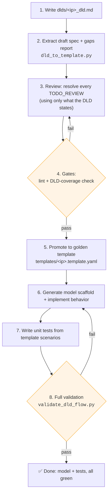
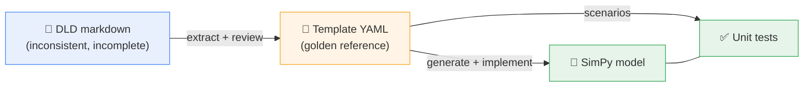
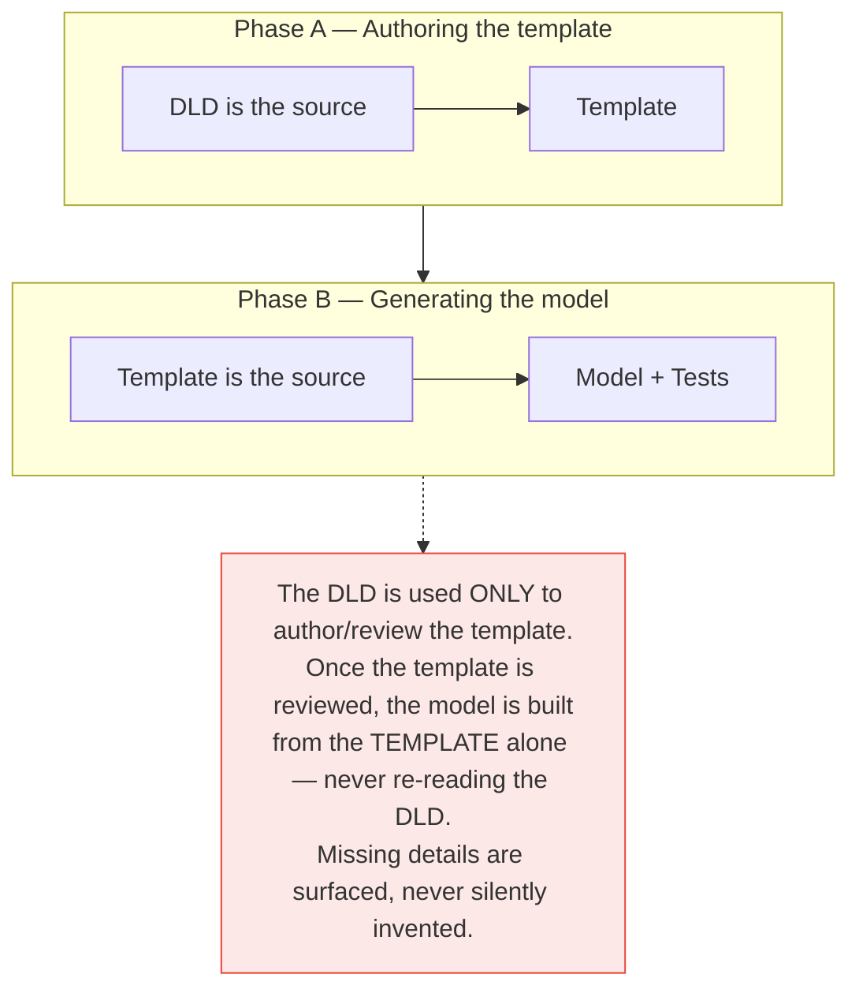
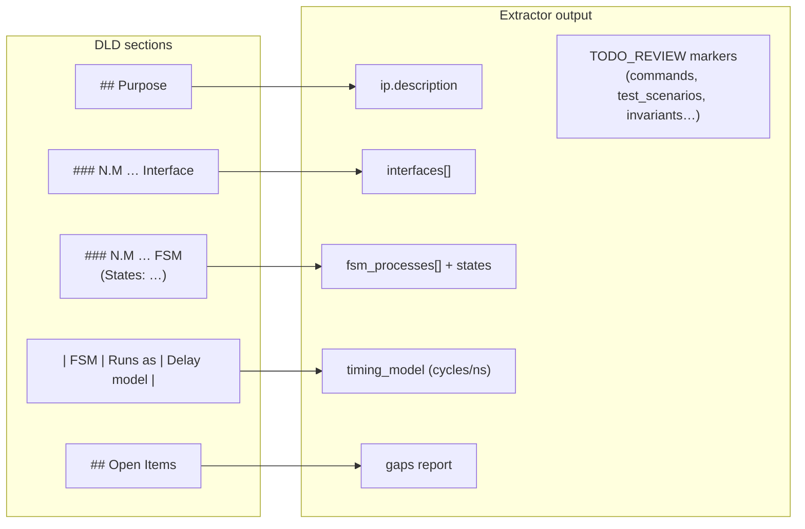
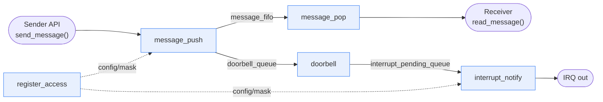
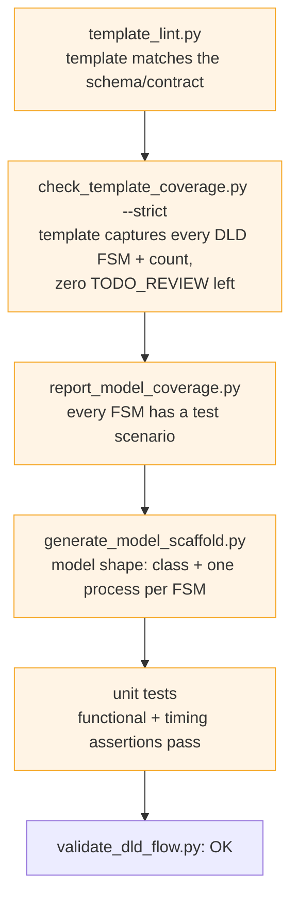
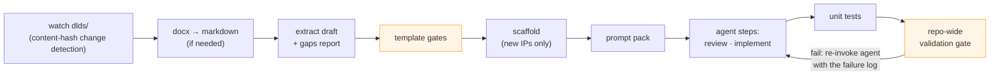
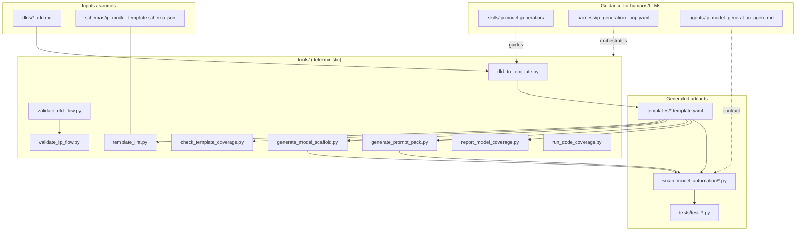

# IP Model Automation — Project Overview

**Reading this for the first time?** This document answers three questions, in
order:

1. [What does this system do for me?](#part-1--what-this-system-does-for-you)
2. [How do I generate a model and unit tests from my DLD?](#part-2--how-to-go-from-a-dld-to-a-model--tests)
3. [What actually happens in the background?](#part-3--how-it-works-behind-the-scenes)
4. [Show me one real IP, end to end.](#part-4--worked-example-mailbox_ip-end-to-end)

The exact CLI command reference lives in the [README](../README.md). Current
project status is at the [end of this document](#part-5--current-status).

> **Prefer Word?** This document also exists as
> [project_overview.docx](project_overview.docx) with all diagrams embedded —
> same content, shareable outside the repo.
>
> **Standalone diagrams:** every flow diagram in this document also exists as
> a plain SVG image in [docs/diagrams/](diagrams/) — open
> [diagrams/index.html](diagrams/index.html) in a browser to view them all, or
> drop the individual `.svg` files straight into slides and documents. No
> markdown/mermaid viewer needed.

---

# Part 1 — What this system does for you

## The one-sentence version

> You write a design document for your hardware IP block; this system turns it
> into a **runnable performance model** (Python/SimPy) and a **unit test
> suite** — with automated checks at every step so nothing is invented or
> lost along the way.

## What goes in, what comes out

**You provide:** a DLD (Design-Level Document) — an ordinary markdown (or
Word) file describing your IP block: what it does, its interfaces, its
internal state machines (FSMs), and how many cycles each operation takes.
Examples live in `dlds/` — e.g. [timer_ip_dld.md](../dlds/timer_ip_dld.md).

**You get back:**

| Output | What it is | Where it lands |
| --- | --- | --- |
| **SimPy model** | A Python simulation of your IP: every FSM runs as a concurrent process, every delay comes from your DLD's timing table. You can run traffic through it and measure latency, throughput, backpressure. | `src/ip_model_automation/<ip>.py` |
| **Unit tests** | Tests that check the model's functional behavior *and* its timing against what the DLD stated. | `tests/test_<ip>.py` |
| **Gaps report** | A checklist of everything your DLD *didn't* say (missing timing, unclear behavior, open items) — so you know exactly what to clarify instead of discovering it later. | `reports/<ip>.gaps.md` |
| **Readable spec** | A clean, browsable HTML/Markdown rendering of the normalized spec extracted from your DLD — handy for reviews. | `reports/template_docs/` |

## Why would I want a SimPy model?

Long before RTL exists, a transaction-level delay model lets you answer
questions like:

- *What's the end-to-end latency of a DMA descriptor under load?*
- *Where does backpressure build up when the completion queue is slow?*
- *Is the arbitration policy fair across tenants at high occupancy?*

The repo includes a ready-made experiments layer (`tools/run_experiments.py`)
that sweeps a model parameter against a fixed workload and produces CSV +
markdown result tables.

## The core promise: nothing is invented

DLDs are written by humans, so they vary in format and always omit *something*.
This system **never guesses**. Anything the DLD doesn't state is flagged in
the gaps report and marked `TODO_REVIEW` for a human (or an LLM under a strict
contract) to resolve — using only what the DLD actually says. Automated gates
block progress until every marker is resolved. That's what makes the generated
model trustworthy.

---

# Part 2 — How to go from a DLD to a model + tests

## The short version (fully automated)

Drop your DLD into `dlds/` and run the pipeline:

```powershell
# 1. Add your document (markdown or .docx both work)
copy my_ip_dld.md dlds\

# 2. Run the automated pipeline
python tools\auto_ip_pipeline.py
```

The pipeline detects the new document and drives everything: extraction,
review prompts, gate checks, model scaffolding, implementation prompts, unit
tests, and a final repo-wide validation. Two steps in the middle need
judgment (reviewing the extracted spec, and implementing model behavior) —
for those the pipeline either:

- **writes a ready-to-send prompt** to `reports/agent_requests/` and pauses,
  telling you which IP is *awaiting* which step (you or an LLM complete it,
  then re-run), **or**
- **runs unattended** if you give it an LLM command — it pipes the prompt in,
  validates the result, and retries with the failure log if validation fails:

  ```powershell
  python tools\auto_ip_pipeline.py --agent-cmd "claude -p --permission-mode acceptEdits"
  ```

When the pipeline reports green, you have a validated model in
`src/ip_model_automation/` and passing tests in `tests/`.

## The step-by-step version (manual, so you see each stage)



1. **Write the DLD** — `dlds/<ip>_dld.md`, with the usual sections: Purpose,
   Interfaces, FSMs (with their states), a timing table, and Open Items.
   Any existing DLD in `dlds/` is a good example to copy the shape of.

2. **Extract** a draft spec and a gaps report:

   ```powershell
   python tools\dld_to_template.py dlds\<ip>_dld.md
   ```

3. **Review** the draft (`templates/<ip>.template.draft.yaml`): replace every
   `TODO_REVIEW` marker. The rule: fill in only what the DLD states — if the
   DLD is silent, fix the DLD (or record the decision there), don't invent.

4. **Pass the gates**, then **promote** the draft:

   ```powershell
   python tools\check_template_coverage.py templates\<ip>.template.draft.yaml dlds\<ip>_dld.md --strict
   python tools\template_lint.py templates\<ip>.template.yaml
   ```

5. **Generate the model scaffold** and fill in behavior *from the template
   only*:

   ```powershell
   python tools\generate_model_scaffold.py templates\<ip>.template.yaml --output-dir src\ip_model_automation
   ```

6. **Write unit tests** from the template's `test_scenarios` (and register
   the model in `common.py` + `ip.py`).

7. **Validate everything**:

   ```powershell
   python tools\validate_dld_flow.py
   ```

This exact path added `mailbox_ip`, `spi_master_ip`, and `i3c_ip` to the repo:
brand-new DLDs in, validated models and tests out.

## What makes a DLD "extract well"

The extractor understands common DLD conventions. It reliably picks up:

- FSM names, their states, and the total FSM count
- Interface sections
- Per-FSM timing operations and the clock rate

It deliberately leaves for human review: command encodings, test scenarios,
invariants, and transition details — these are where DLDs are most often
ambiguous, so they get flagged instead of guessed.

---

# Part 3 — How it works behind the scenes

## The central idea: a template in the middle

The system never generates a model directly from the DLD. The DLD is
human-written prose — inconsistent and incomplete by nature. Instead, a
normalized, machine-checkable **template** (a YAML file with a fixed schema)
sits in the middle as the *golden reference*:



The template captures, in one fixed shape regardless of how the DLD was
written: the IP's FSM processes and states, interfaces, commands, timing
model, invariants, and test scenarios. The annotated
`templates/reference_template.yaml` documents every section.

### Two sources of truth — but only one at a time

This is the rule the whole system is built around:



Why this matters: a reviewer signs off the template **once**, and everything
downstream (model, tests, docs, experiments) is a faithful function of that
reviewed artifact. If the model did something the template doesn't say, that's
a bug — not a judgment call.

## Stage 0: DLD → reviewed template

`tools/dld_to_template.py` is a best-effort parser, not an oracle. It maps
DLD sections onto template fields and marks everything else:



The **gaps report** (`reports/<ip>.gaps.md`) combines the DLD's own "Open
Items" section with every field the extractor couldn't derive. The point:
missing information becomes *visible and tracked* instead of silently filled
with a plausible-but-wrong assumption.

**How we know the extractor can be trusted:** it's calibrated against every
existing golden IP — re-parsing each DLD must reproduce its template's FSM
name set exactly, and the DLD's stated FSM count must match the template's
`fsm_count`. That equality runs as a regression gate; if a change breaks
extraction, calibration fails loudly. (Interface matching is report-only,
because templates legitimately consolidate DLD interface sections; FSM
coverage is the hard gate.)

## Stage 1: template → model + tests

From the reviewed template:

- `tools/generate_model_scaffold.py` emits a SimPy skeleton — one model
  class, one process method per template FSM.
- `tools/generate_prompt_pack.py` bundles the template + contract + skill
  instructions into a self-contained prompt, so an LLM can fill in behavior
  without seeing (or needing) anything else.
- The implementer — human or LLM — fills in model behavior and unit tests
  **from the template only**.

### What a generated model looks like

Each template FSM becomes one concurrent SimPy process; queues and stores
connect them. Here is the real **Mailbox IP** model (added through this
pipeline):



Reading this diagram: when software calls `send_message()`, the
`message_push` process enqueues the message (blocking if the FIFO is full —
that's backpressure), raises a doorbell, and the doorbell flows through
`interrupt_notify` to become an IRQ — unless the channel is masked via the
`register_access` process. Every arrow hop costs the number of cycles the
DLD's timing table specified.

Every model also ships with:

- **IP-tagged logging** (`[mailbox_ip] …`) with `log_level` / `log_file`
  constructor arguments (default `WARNING`; also appends to `run.log`), and
- a **`metrics` dict** the unit tests assert on (counts, latencies,
  occupancies).

### Code conventions

- One **flat** file per IP: `src/ip_model_automation/<ip>.py` — no per-IP
  folders, and no files named `perf_model.py` / `functional_model.py` /
  `soc_models.py` (deliberate repo rule).
- Shared dataclasses, registry metadata, and helpers: `common.py`;
  public export surface: `ip.py`.
- Per-IP tests in `tests/test_<ip>.py`, derived from the template's
  `test_scenarios`.

Run the whole test suite from the repo root:

```powershell
$env:PYTHONPATH="$PWD\src"
python -m unittest discover -s tests
```

## The gates: what "validated" actually means

Every stage is guarded by an automated check. Nothing advances until its gate
is green — this is what lets a reviewer trust a green result without
re-reading everything:



One command — `python tools\validate_dld_flow.py` — runs the front-end gate
for **every** DLD in the repo (template exists, lints, covers its DLD), then
the model/test flow, and regenerates the readable template docs. A single
green result proves the whole repo is consistent.

Alongside the template-side FSM/scenario coverage above, `python
tools\run_code_coverage.py` measures *code* coverage — which model lines the
unit tests actually execute (coverage.py, table + optional `--html` report in
`reports\code_coverage\`). It runs as an informational repo-wide stage in the
automated pipeline; pass `--fail-under N` to use it as a hard gate.

## The automated pipeline runner

`tools/auto_ip_pipeline.py` is the orchestrator that strings all of the above
together so you don't have to run each tool by hand. It is a generic stage
engine: the stage sequence it executes — commands, agent steps and their
gates, skip conditions, per-IP vs. repo-wide scope — is declared in
`harness/ip_generation_loop.yaml`, which is the single source of truth for
the pipeline. Changing the pipeline is a YAML edit, not a runner change:



Details worth knowing:

- **Change detection** hashes DLD content into
  `reports/.dld_pipeline_state.json`. An IP is only marked *processed* after
  its full chain passes — so a half-finished IP is automatically picked up
  again next run.
- **The two agent steps** (template review, model implementation) are the
  only places judgment is needed. Each declares `gates:` in the harness YAML
  — tool stages whose pass/fail decides everything: if the gates already
  pass, the agent is skipped entirely. Without `--agent-cmd`, the runner
  writes the prompt to `reports/agent_requests/<ip>.<step>.prompt.md` and
  reports the IP as *awaiting*. With `--agent-cmd`, it pipes the prompt to
  your LLM command and, while the gates fail, re-invokes it with the failure
  log — up to `max_attempts` per stage (default `loop_policy.max_iterations`).

## Beyond single IPs: subsystems

A subsystem (several IPs wired together) is modeled as **"just another IP"**:
its FSM processes are the glue between member IP models, and the member
models are its resources. It rides the same DLD → template → model → tests
pipeline, so every gate applies unchanged. One extra check,
`tools/check_subsystem_wiring.py`, verifies the wiring is real: members
exist, the member APIs and glue FSMs referenced by `connections:` exist, and
the model actually instantiates its members.

## Map of the repository



| Area | Role |
| --- | --- |
| `dlds/*_dld.md` | Your design intent (authoring source only). |
| `templates/*.template.yaml` | **Golden reference** — source of truth for generation. |
| `templates/*.template.draft.yaml` | Extractor output awaiting review (gitignored). |
| `schemas/…schema.json` | Machine-checkable template contract. |
| `tools/*.py` | Deterministic extraction, linting, coverage, generation, validation. |
| `skills/…`, `harness/…`, `agents/…` | Instructions/contract for the human or LLM that fills templates, models, and tests. |
| `src/ip_model_automation/*.py` | Flat, one-file-per-IP SimPy delay models. |
| `tests/test_*.py` | Per-IP unit tests derived from `test_scenarios`. |
| `reports/` | All generated output (gitignored): gaps reports, readable template docs, agent requests, experiment results, pipeline state. |
| `prompt_packs/` | Generated LLM prompt bundles (gitignored). |

---

# Part 4 — Worked example: `mailbox_ip`, end to end

`mailbox_ip` was added to this repo through the exact pipeline described in
Parts 2 and 3 — a brand-new DLD in, a validated model and tests out. Every
artifact below exists in the repo, so you can open each file and follow along.

## The input: one markdown DLD

[dlds/mailbox_ip_dld.md](../dlds/mailbox_ip_dld.md) describes a multi-channel
inter-processor mailbox in ordinary prose: purpose and scope, four interfaces,
five FSMs with their states, a per-FSM timing table, and an honest **Open
Items** list. The parts the extractor will lean on look like this:

```text
### 6.2 Message Push FSM

Role: Accept sender messages and enqueue them into the channel FIFO.

States:
- IDLE
- ACCEPT_MESSAGE
- CHECK_SPACE
- ENQUEUE
- REJECT_FULL

| FSM/process      | Runs as                      | Delay model                       |
| ---              | ---                          | ---                               |
| Message Push FSM | Parallel per-channel process | Accept message: 1 cycle = 2 ns. … |
```

And what the author *didn't* know yet (section 12, Open Items): the number of
channels, message width, FIFO depth per channel, interrupt target routing, and
overflow-error behavior. These stay visible through the whole flow instead of
being silently guessed.

## Step 1 — extract a draft spec + gaps report

```powershell
python tools\dld_to_template.py dlds\mailbox_ip_dld.md
```

```text
wrote draft:  templates\mailbox_ip.template.draft.yaml
wrote report: reports\mailbox_ip.gaps.md
wrote doc:    reports\template_docs\mailbox_ip.template.draft.html
Next: resolve TODO_REVIEW markers, lint, check coverage, then promote.
```

The extractor found the mechanical facts on its own, and flagged exactly the
judgment-needing parts (this is the real report):

```text
## Extracted
- FSMs (5): register_access, message_push, message_pop, doorbell, interrupt_notify
- Interfaces (4): register_if, sender_message_if, receiver_message_if, interrupt_output_if
- Declared fsm_count: 5

## Missing / To Review
- commands: not derivable from DLD; TODO_REVIEW placeholder emitted
- test_scenarios: author from DLD behavior; TODO_REVIEW placeholder emitted
- functionality_model.invariants/apis/state_variables: complete from DLD

## DLD Open Items
- Number of mailbox channels.
- Message width.
- FIFO depth per channel.
- Interrupt target routing policy.
- Whether an overflow raises an error interrupt.
```

## Step 2 — review: resolve every `TODO_REVIEW`

A reviewer (human or LLM under the contract) replaced each marker using only
DLD-stated behavior. For example, the DLD's Message Flow section ("a message is
accepted only when the target channel FIFO has space; a full channel applies
backpressure") became this reviewed command entry:

```yaml
- name: SEND_MESSAGE
  description: Sender writes a message into a channel FIFO.
  fields: [channel_id, message]
  valid_conditions: [channel_enabled, fifo_has_space]
  completion_conditions: [message_enqueued]
  error_conditions: [fifo_full]
  functional_effects: [enqueue_message, raise_doorbell]
  timing_effects: [push_delay]
```

The unresolved Open Items were handled the conservative way: channel count and
FIFO depth became **model constructor parameters** with bounded defaults
(`num_channels=4`, `fifo_depth=8`, recorded in the template's `queues:`
section), so experiments can sweep them and nothing is hard-wired on a guess.

## Step 3 — pass the gates, promote to golden

```powershell
python tools\check_template_coverage.py templates\mailbox_ip.template.draft.yaml dlds\mailbox_ip_dld.md --strict
python tools\template_lint.py templates\mailbox_ip.template.yaml
```

For `mailbox_ip` these proved: all five DLD FSM names and the declared
`fsm_count: 5` are captured, every state list matches, zero `TODO_REVIEW`
markers remain, and the YAML satisfies the schema/contract. The draft was then
renamed to the golden
[templates/mailbox_ip.template.yaml](../templates/mailbox_ip.template.yaml) —
from here on, the DLD is never read again.

## Step 4 — scaffold + implement the model

```powershell
python tools\generate_model_scaffold.py templates\mailbox_ip.template.yaml --output-dir src\ip_model_automation
```

Each of the five template FSMs became one concurrent SimPy process in
[src/ip_model_automation/mailbox_ip.py](../src/ip_model_automation/mailbox_ip.py)
(the process/queue picture is in Part 3, "What a generated model looks like" —
also standalone at [diagrams/07_example_mailbox_model.svg](diagrams/07_example_mailbox_model.svg)).
Here is the real
`message_push` process — note how every line traces back to the template: the
state names, the `message_fifo` bounded queue, the doorbell hand-off, and the
`REJECT_FULL` drop path:

```python
def message_push_process(self):
    while True:
        self.fsm_state["message_push"] = "IDLE"
        channel_id, message = yield self.sender_if.get()
        self.fsm_state["message_push"] = "ACCEPT_MESSAGE"
        yield self.env.timeout(self.lat["push"])
        self.fsm_state["message_push"] = "CHECK_SPACE"
        fifo = self.message_fifos[channel_id]
        if len(fifo) < self.fifo_depth:
            fifo.append(message)
            self.fsm_state["message_push"] = "ENQUEUE"
            self.metrics["enqueued_messages"] += 1
            yield self.doorbell_queue.put(channel_id)
        else:
            self.fsm_state["message_push"] = "REJECT_FULL"
            self.metrics["dropped_on_full"] += 1
            self.logger.warning("channel fifo full channel=%s message dropped", channel_id)
```

## Step 5 — unit tests from the template's scenarios

The template's `test_scenarios:` section is the test plan. Its second scenario:

```yaml
- name: full_fifo_applies_backpressure
  description: Sending beyond FIFO depth drops or stalls messages on a full channel.
  input_sequence: [CONFIG_CHANNEL_0, SEND_MESSAGE_BURST]
  expected_functional_behavior: [dropped_on_full_counted]
  fsm_coverage: [message_push.CHECK_SPACE, message_push.REJECT_FULL]
```

became this test in [tests/test_mailbox_ip.py](../tests/test_mailbox_ip.py):

```python
def test_full_fifo_applies_backpressure(self):
    env = simpy.Environment()
    model = MailboxIpModel(env, fifo_depth=4)
    model.set_receiver_enabled(False)
    model.configure_channel(0)
    for index in range(6):
        model.send_message(0, f"m{index}")
    env.run(until=20)
    self.assertEqual(model.metrics["enqueued_messages"], 4)
    self.assertEqual(model.metrics["dropped_on_full"], 2)
```

Six sends into a depth-4 FIFO with the receiver stalled: exactly 4 enqueue,
exactly 2 hit `REJECT_FULL` — the DLD's backpressure statement, now executable.

## Step 6 — the repo-wide gate

```powershell
python tools\validate_dld_flow.py
```

Green means, for `mailbox_ip` specifically: its template lints and covers its
DLD, the scaffold check finds the model class with one process per FSM, every
FSM appears in a test scenario, and its unit tests pass alongside the rest of
the suite. From that point `mailbox_ip` is a first-class citizen — it was later
reused unchanged as the doorbell source inside the `mailbox_irq_subsystem`.

## Where each DLD statement ended up

| DLD says | Template captures it as | Model implements it | Test proves it |
| --- | --- | --- | --- |
| "A full channel applies backpressure to the sender" (§4.2) | `SEND_MESSAGE.error_conditions: [fifo_full]`; `queues.message_fifo.blocking_behavior: backpressure` | `message_push_process` `REJECT_FULL` branch | `test_full_fifo_applies_backpressure` |
| "Enqueue precedes doorbell; doorbell precedes interrupt" (§11) | `sequential_paths: message_to_interrupt_path` | `doorbell_queue` → `interrupt_pending_queue` hand-offs | `test_message_enqueue_delivers_and_interrupts` |
| "Doorbell interrupt is level, asserted until software clears" (§4.4) | invariant: "stays asserted until software clears it" | `clear_interrupt()` API + `doorbell_status` set | subsystem tests (`mailbox_irq_subsystem`) |
| Per-FSM cycle counts (§11 timing table) | `timing_model.fsm_process_delays` | latency constructor parameters (`self.lat`) | timing assertions in per-IP tests |
| Open Items: channel count, FIFO depth (§12) | gaps report + `queues.message_fifo.depth` | `num_channels` / `fifo_depth` constructor parameters | swept by `run_experiments.py` scenarios |

One footnote: this walkthrough shows the manual, stage-by-stage path so each
artifact is visible. Today the automated runner does all of it from the DLD
drop onward — `python tools\auto_ip_pipeline.py` (Part 3).

---

# Part 5 — Current status

*As of 2026-07-12: all gates green — `validate_dld_flow.py` OK, full unit
suite passing (run it for the current count).*

## Modeled IPs (9)

| IP | What it models |
| --- | --- |
| `arbitration_ip` | Hierarchical port/tenant/SQ arbitration with pending bitmaps, RR/WRR policy, burst-limited issue pipeline. |
| `completion_ip` | Command completion scheduling with per-tenant QoS tokens, window-based refill, output backpressure. |
| `gdma_ip` | Descriptor-driven DMA with multiple parallel/sequential FSMs. |
| `timer_ip` | Register, tick, compare, watchdog, debug-freeze, and interrupt timer behavior. |
| `axi_interconnect_ip` | AXI read/write routing, arbitration, response routing, decode-error handling. |
| `interrupt_controller_ip` | Source sampling, pending/filter/priority, delivery, ACK, EOI, software interrupts. |
| `mailbox_ip` | Multi-channel inter-processor messaging: per-channel FIFOs, doorbells, masked interrupt aggregation. |
| `spi_master_ip` | SPI master with TX/RX byte FIFOs, bit-shift transfer engine, chip-select framing, masked interrupts. |
| `i3c_ip` | I3C master with queued command engine, bit-level SDR transfer engine, IBI detection/arbitration, masked interrupts. |

## Modeled subsystems (2)

| Subsystem | What it composes |
| --- | --- |
| `dma_subsystem` | Connected data-mover composing `gdma_ip`, `axi_interconnect_ip`, `arbitration_ip`, `completion_ip`. Descriptors fan out to an engine leg and a fabric leg; the subsystem IRQ fires when both legs complete. A backpressure monitor couples fabric congestion to GDMA memory readiness and completion backlog to arbitration issue readiness. |
| `mailbox_irq_subsystem` | Interrupt-delivery cluster composing `mailbox_ip` (doorbell source) and `interrupt_controller_ip` (delivery fabric) with a modeled software service loop (ack, read, clear, EOI). True level-triggered semantics (EOI re-pends while unserviced messages remain) and duty-cycle interrupt-storm throttling. |

## Pipeline maturity

- `mailbox_ip`, `spi_master_ip`, and `i3c_ip` were added **end-to-end through
  the pipeline**: brand-new DLDs went through extraction, review, modeling,
  and testing, and the whole suite validated. The same path carries both
  subsystems.
- The change-driven runner (`auto_ip_pipeline.py`), readable template docs
  (Markdown + HTML), and the performance-experiments layer are in place.
- Extractor calibration holds for every golden IP (FSM name set + count
  reproduce exactly).

---

# Summary

- You write a **DLD**; the system produces a **validated SimPy model** and
  **unit tests**.
- A **normalized template** sits in the middle as the golden reference — the
  DLD authors it, the template generates everything else.
- **Deterministic tools** do extraction, linting, coverage, and validation; a
  **human or LLM** fills the judgment gaps under a strict contract.
- **Missing details are surfaced** in a gaps report, never invented.
- **Every stage has an automated gate**, and one command
  (`validate_dld_flow.py`) proves the whole repo is consistent.
